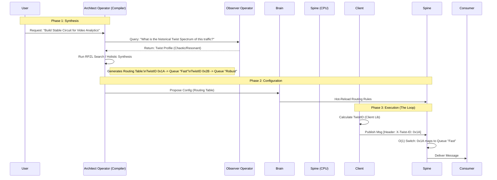

# vNext Smart Circuit Workflow

This document explains the "Compiler vs. CPU" architecture of ArqonBus vNext, specifically how advanced "physics" features (Twist Routing, Holistics, TTC) are implemented without compromising the strict O(1) performance of the Spine.

---

## 1. The Core Split: Compiler vs. CPU

The fundamental rule of ArqonBus vNext is that **Complexity lives at the Edge; Speed lives in the Center.**

- **The "Compiler" (Architect Operator)**
  - **Role:** Synthesis, Prediction, Complex Math.
  - **Budget:** Seconds or Minutes (Off-line).
  - **Logic:** "Run 10,000 simulations to find the perfect routing table."
  
- **The "CPU" (The Spine)**
  - **Role:** Message Switching.
  - **Budget:** Microseconds (On-line).
  - **Logic:** "Read Header `X-Twist-ID`. Look up ID. Send to Queue."

---

## 2. The Lifecycle of a Smart Circuit

This workflow demonstrates how a **Twist-Routed Circuit** goes from request to execution.



---

## 3. Implementation Details

### Twist-Based Routing (The "Switch")

We do not run matrix multiplication on the bus. We use **Stamp and Switch**.

1.  **Stamping (Client Side / Broker Side):**
    The `TwistID` is calculated *before* the message hits the switch fabric.
    ```protobuf
    // The Envelope
    message Envelope {
      bytes payload = 1;
      map<string, string> headers = 2; // contains "x-twist-id": "8a4f"
    }
    ```

2.  **Switching (Spine Side):**
    The Spine uses a simple Hash Map lookup.
    ```rust
    // O(1) Lookup
    let queue = routing_table.get(header.twist_id).unwrap_or(default_queue);
    ```

### Holistic Synthesis (The "Compiler")

"Holistic Synthesis" means optimizing the *entire* graph at once, rather than letting each node optimize itself.

1.  **The Inputs:**
    - **Operator Capabilities:** "I can process 10k msg/s but I crash if variance > 2.0"
    - **Traffic Physics:** "This stream usually has a fractal burstiness of D=1.6"
    
2.  **The Process (The Architect):**
    - The Architect runs an **RPZL Search** (Recursive Prime Zoom) to find a configuration where the *entire circuit* remains stable.
    - It might decide: "Route all D>1.5 traffic to Shard B, and use FEC (TTC Mode)."

3.  **The Output:**
    - A static **Configuration Artifact**.
    - If the synthesis fails (prediction says "Unstable"), the deployment is rejected.

---

## 4. Why this matters

This architecture protects ArqonBus from "Intelligence Bloat."
- If the **Architect** hallucinates or has a bug, it produces a bad *Config*, which can be rejected by the **Brain** (via Policy-as-Code).
- The **Spine** never stalls waiting for a prediction. It only acts on pre-calculated decisions.
