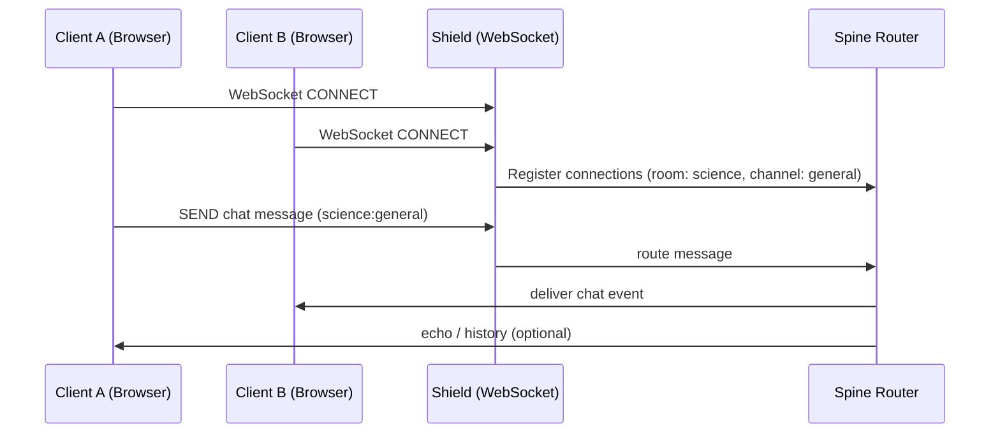
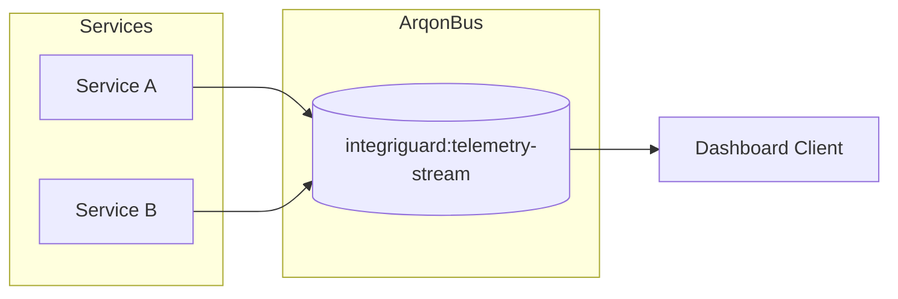
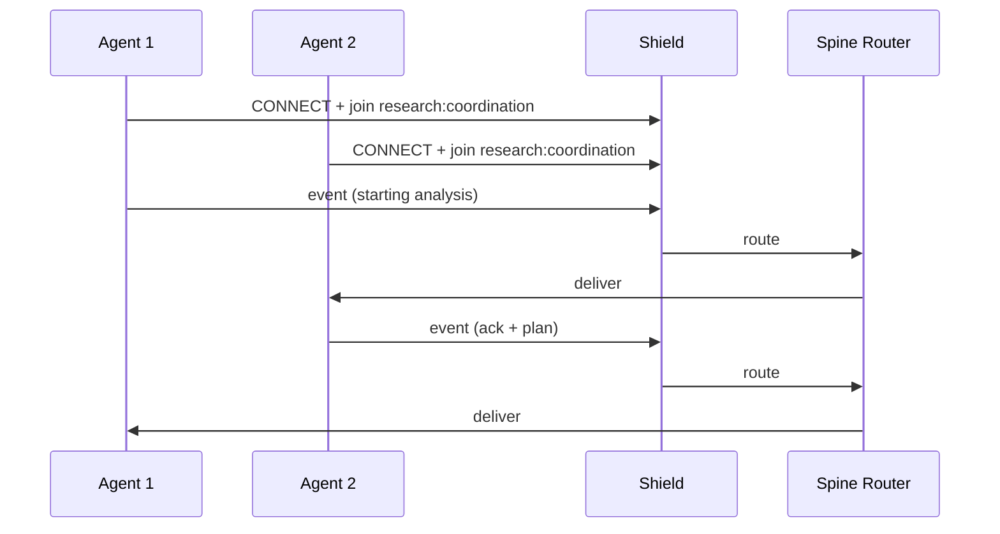
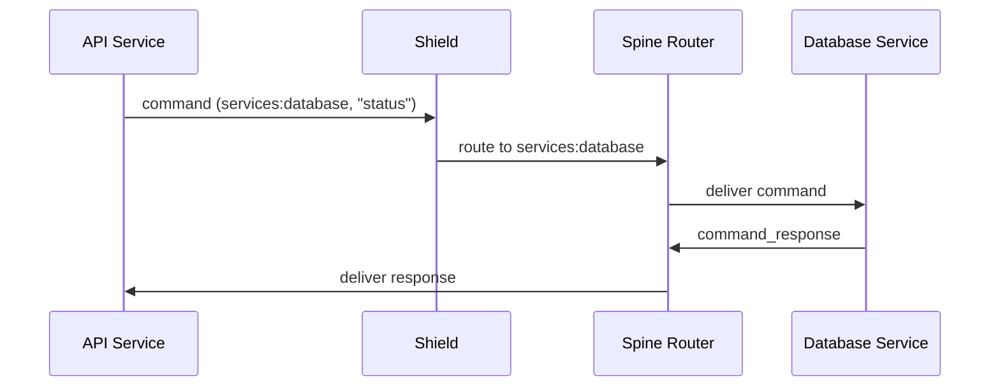

# ArqonBus by Example – Hands-On Scenarios

This tutorial walks through **concrete, end-to-end examples** of ArqonBus usage, focusing on:

- Basic WebSocket integration.
- Real-time telemetry dashboards.
- Multi-agent coordination.
- Enterprise command/response patterns.

It is grounded in `docs/arqonbus/specs/001-core-message-bus/quickstart.md` and the 001 data model, with additional notes for multi-tenancy and safety.

---

## 1. Example 1 – Basic Chat over WebSocket

### 1.1 Scenario

- Multi-user chat using:
  - Web browser clients.
  - WebSocket connection to ArqonBus Shield.
  - Rooms and channels for routing.

### 1.2 Flow diagram



### 1.3 Message shapes

**Join channel command**:

```json
{
  "version": "1.0",
  "id": "arq_sub_001",
  "type": "command",
  "room": "science",
  "channel": "general",
  "from": "web_client_1",
  "timestamp": "2025-01-01T12:00:00.000Z",
  "payload": {
    "command": "join_channel",
    "parameters": {}
  }
}
```

**Chat event**:

```json
{
  "version": "1.0",
  "id": "arq_msg_001",
  "type": "event",
  "room": "science",
  "channel": "general",
  "from": "web_client_1",
  "timestamp": "2025-01-01T12:00:05.000Z",
  "payload": {
    "message": "Hello everyone!"
  }
}
```

### 1.4 What the bus guarantees

- Consistent message envelope fields (version, id, type, room, channel, from, timestamp).
- Routing based on room/channel (or mapped subjects).
- The ability to add:
  - Presence events (join/leave).
  - History (if backed by Redis Streams or similar).

---

## 2. Example 2 – Real-Time Telemetry Dashboard

### 2.1 Scenario

- A monitoring client subscribes to a stream of telemetry events.
- ArqonBus routes system events and metrics to the dashboard.

### 2.2 Flow diagram



### 2.3 Telemetry event example

```json
{
  "version": "1.0",
  "id": "telemetry_001",
  "type": "event",
  "room": "integriguard",
  "channel": "telemetry-stream",
  "from": "spine_router",
  "timestamp": "2025-01-01T12:00:00.000Z",
  "payload": {
    "metric": "active_clients",
    "value": 42,
    "labels": {
      "tenant": "demo",
      "region": "eu-west-1"
    }
  }
}
```

### 2.4 Why this matters

- Dashboards are just **subscribers** on the same bus as everyone else.
- The bus’s multi-tenant and safety rules still apply:
  - Metrics are tenant-scoped.
  - Sensitive fields can be redacted or filtered by policy.

---

## 3. Example 3 – Multi-Agent Coordination Channel

### 3.1 Scenario

- Multiple AI agents coordinate on a shared channel.
- Each message carries structured metadata (e.g., personality, priority).

### 3.2 Flow diagram



### 3.3 Agent message example

```json
{
  "version": "1.0",
  "id": "arq_agent_001",
  "type": "event",
  "room": "research",
  "channel": "coordination",
  "from": "research_agent_1",
  "timestamp": "2025-01-01T12:00:00.000Z",
  "payload": {
    "message": "Starting analysis phase",
    "metadata": {
      "personality": "analytical",
      "priority": "high",
      "expected_duration": "5_minutes"
    }
  }
}
```

### 3.4 Extensions

- Attach **observer/modeler** operators that:
  - Subscribe to the same channel.
  - Predict agent behavior or flag anomalies.
- Add **content-aware safety**:
  - Inspect agent messages for policy violations before delivery.

---

## 4. Example 4 – Enterprise Command/Response Between Services

### 4.1 Scenario

- Backend services communicate via command/response patterns.
- History is persisted for auditing (e.g., Redis Streams).

### 4.2 Flow diagram



### 4.3 Command and response examples

**Command**:

```json
{
  "version": "1.0",
  "id": "arq_cmd_001",
  "type": "command",
  "room": "services",
  "channel": "database",
  "from": "api_service",
  "timestamp": "2025-01-01T12:00:00.000Z",
  "payload": {
    "command": "status",
    "parameters": { "check": "connection_pool" }
  }
}
```

**Command response**:

```json
{
  "version": "1.0",
  "id": "arq_resp_001",
  "type": "command_response",
  "room": "services",
  "channel": "database",
  "from": "db_service",
  "timestamp": "2025-01-01T12:00:00.025Z",
  "payload": {
    "request_id": "arq_cmd_001",
    "status": "success",
    "result": {
      "active_connections": 15,
      "max_connections": 100,
      "avg_response_time_ms": 2.3
    }
  }
}
```

### 4.4 Multi-tenancy and safety hooks

- Tenant information belongs in:
  - Subjects/keys (e.g. `tenant.services.database`).
  - Labels or headers, depending on implementation.
- Safety inspectors can:
  - Scan payloads for policy violations.
  - Block or tag certain commands.

---

## 5. Next Steps

From here, you can move to:

- **Safety & Inspection**: `tutorial/arqonbus_safety_inspection.md`
- **QHE Integration**: `tutorial/arqonbus_qhe_integration.md`
- **Emergent Operators & Control**: `tutorial/arqonbus_emergent_operators.md`

