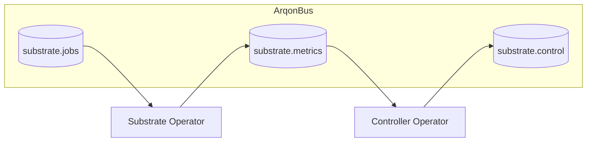
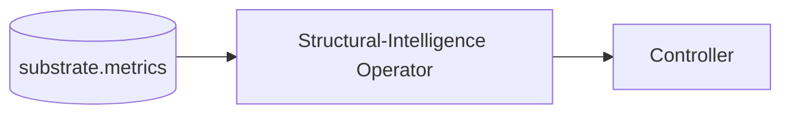
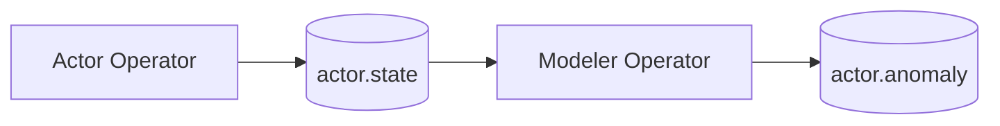
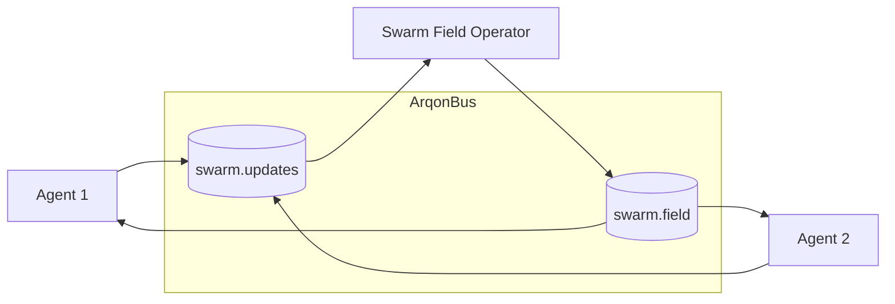

# Emergent Operators & Control – ArqonBus + Emergenics

This tutorial shows how **Emergenics concepts** (emergent substrates, structural intelligence, Omega Cognition, cosmogony) map onto ArqonBus operators and circuits.

It builds on:

- `docs/emergenics/emergence_engineering.md`
- `docs/emergenics/structural_intelligence.md`
- `docs/emergenics/physics.md`, `docs/emergenics/cosmogony.md`
- `docs/emergenics/omega_cognition_summary.md`
- `docs/projects/novelbytelabs/arqonbus/arqonbus_vnext.md`

---

## 1. Substrate Operators

### 1.1 What is a substrate operator?

From Emergence Engineering and cosmogony docs:

- A substrate is a **long-lived field or automaton** with:
  
    - Local rules.
    - Global parameters.
    - Internal state evolving over time.

Examples:

- GNLNA / NLCA fields.
- Roo/Tau spatiotemporal fields.
- Cosmic lattice engines (RCE).
- Prime geometry descriptor spaces.

In ArqonBus terms, a substrate operator:

- Exposes:
  
    - `substrate.jobs` (initialization, major interventions).
    - `substrate.control` (parameter tuning).
    - `substrate.metrics`, `substrate.streams` (telemetry).

### 1.2 Substrate + controller pattern

This matches:

- Emergent substrate + adaptive controller in Emergence Engineering.
- Multi-layer control hierarchies described in `arqonbus_vnext.md`.

---

## 2. Structural-Intelligence Operators

### 2.1 Fold/twist/prime reasoning

From `structural_intelligence.md`:

- Fold-space and twist-space view:
  
     - Arithmetic, physics, and symbolic logic as geometric flows.
  
- Structural-intelligence machines can:
  
     - Detect inconsistencies.
     - Perform code-space reasoning without training.

In ArqonBus:

- Structural-intelligence operators can act as:
  
   - **Oracles**:
  
      - Subscribe to telemetry or configs.
      - Emit judgments or constraints.
  
  - **Semantic compressors**:
  
      - Map high-volume streams into semantic kernels/IDs.

### 2.2 Oracle pattern

Examples:

- A twist-field oracle that:
  
     - Receives descriptors from a substrate.
     - Flags regimes as safe/unstable.
     - Guides controller actions.

---

## 3. Omega Cognition: Actor–Modeler and Architects

### 3.1 Actor–Modeler pattern

From `omega_cognition_summary.md`:

- Actor:
  
     - Performs the main computation (emergent CPU).
  
- Modeler:
  
     - Predicts Actor’s next state.
     - Emits deviation/error signals.

In ArqonBus:

Anomaly topics feed:

- Controllers.
- Overseers.
- Human operators.

### 3.2 Architect/Physicist discovery engines

Discovery engines:

- Explore rule sets and substrates.
  
- Optimize for:
  
     - Surprise (interestingness).
     - Performance and robustness.

In ArqonBus:

- Architect operators:
  
     - Consume **design spaces** and objectives.
     - Publish **candidate configs** on `design.candidates`.
  
- Physicist/validator operators:
  
     - Evaluate candidates.
     - Emit scores and diagnostics.

---

## 4. Quantum-Inspired Routing & Swarm Fields

From `quantum_bus_ideas.md` and cosmogony:

- **Schrödinger’s packet**:
  
     - Messages stay unassigned until late, then commit to a consumer based on metrics.
  
- **Pseudo-entangled state sync**:
  
     - Shared seeds + small basis updates for efficient state synchronization.
  
- **Swarm fields**:
  
     - A field operator that encodes collective state of many agents.

### 4.1 Swarm field pattern

Agents interact by:

- Publishing local updates to `swarm.updates`.
- Reading the shared field state from `swarm.field`.

---

## 5. Governance for Emergent Operators

Because emergent operators can:

- Self-organize.
- Redesign parts of the system.
- Exhibit unexpected behaviors.

ArqonBus governance must ensure:

- **Namespaces**:
  - Experimental vs production circuits.
- **Quotas and safety**:
  - Bound resource usage and impact.
- **Provenance**:
  - Track where configurations come from (architect engines, humans, scripts).
- **Observability**:
  - Rich metrics and logs for emergent systems.

The same constitutional and doctrinal rules apply:

- Specs for emergent operators.
- CI guardians for protocol/state-machine changes.
- Explicit ownership and TTL for technical debt around emergent behavior.

---

## 6. Next Steps

To keep exploring:

- Re-read:
  - `docs/emergenics/COMPILATION.md`
  - `docs/projects/novelbytelabs/arqonbus/arqonbus_vnext.md`
- Combine this with:
  - `tutorial/arqonbus_foundations.md` for the big picture.
  - `tutorial/arqonbus_qhe_integration.md` for concrete QHE circuits.

