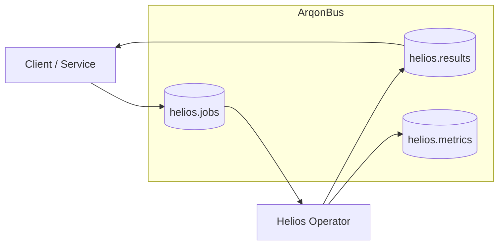
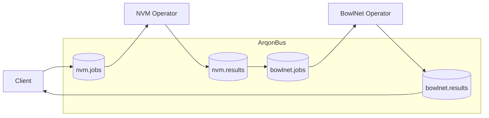

# Integrating QuantumHyperEngine Operators with ArqonBus

This tutorial shows how **QuantumHyperEngine (QHE)** components plug into ArqonBus:

- Helios (ITMD/RR Δ-first engine).
- NVM Pulse Engine (audio/optical compute).
- BowlNet / Phonic ROM / QML backends.

It builds on:

- `docs/projects/novelbytelabs/quantumhyperengine_product.md`
- `docs/projects/novelbytelabs/arqonbus/specification.md`
- The 001 core message bus spec.

---

## 1. Operator Roles for QHE

### 1.1 Helios operator

- Type: **digital compute operator**.
- Exposes topics:
  - `helios.jobs`
  - `helios.results`
  - `helios.metrics`

### 1.2 NVM operator

- Type: **physical or simulated NVM operator**.
- Exposes topics:
  - `nvm.jobs`
  - `nvm.results`
  - `nvm.streams` (pulse/measurement data).

### 1.3 BowlNet / Phonic ROM / QML

- Type: **feature extraction / classification**.
- Exposes topics:
  - `bowlnet.jobs`, `bowlnet.results`
  - `qml.jobs`, `qml.results`

All of them are **ArqonBus operators**:

- Register capabilities with the control plane.
- Subscribe to their `*.jobs` topics.
- Publish to `*.results` / `*.metrics`.

---

## 2. Circuit 1 – Helios-Only Inference

### 2.1 High-level flow



### 2.2 Example Helios job envelope (conceptual)

```json
{
  "version": "1.0",
  "id": "helios_job_001",
  "type": "command",
  "room": "helios",
  "channel": "jobs",
  "from": "inference_service",
  "timestamp": "2025-01-01T12:00:00.000Z",
  "payload": {
    "workload": "attention",
    "precompute_ref": "s3://...",
    "delta_ref": "s3://...",
    "constraints": {
      "max_latency_ms": 50,
      "target_accuracy_delta": 0.01
    }
  }
}
```

The exact payload schema is defined in QHE/Helios specs; the bus cares about:

- Envelope consistency.
- Routing to the right operator.
- Applying quotas and safety rules.

---

## 3. Circuit 2 – NVM Pulse Job with Streams

### 3.1 High-level flow

```mermaid
flowchart LR
  Client[Client / Service]
  subgraph Bus["ArqonBus"]
    NVMJobs[(nvm.jobs)]
    NVMRes[(nvm.results)]
    NVMStreams[(nvm.streams)]
  end
  NVMOp[NVM Pulse Operator\n(physical or simulated)]

  Client --> NVMJobs
  NVMJobs --> NVMOp
  NVMOp --> NVMRes
  NVMOp --> NVMStreams
  NVMRes --> Client
```

### 3.2 NVM job payload (conceptual)

```json
{
  "version": "1.0",
  "id": "nvm_job_001",
  "type": "command",
  "room": "nvm",
  "channel": "jobs",
  "from": "experiment_service",
  "timestamp": "2025-01-01T12:00:00.000Z",
  "payload": {
    "config_ref": "nvm_pulse_config.json",
    "certificate_bytes_b64": "base64-encoded-certificate-here",
    "mode": "audio",
    "options": {
      "quantum_state_teleport": false,
      "vqe_step": null,
      "qml_inference": false
    }
  }
}
```

The operator:

- Encodes certificate into pulses.
- Plays/transmits through the medium.
- Decodes and returns structured results.

---

## 4. Circuit 3 – NVM + BowlNet Classification

### 4.1 Flow



### 4.2 Usage pattern

- **Step 1**: Client sends NVM job to generate physical or simulated responses.
- **Step 2**: NVM results (e.g. transformed signals) are published on `nvm.results`.
- **Step 3**: A small circuit rule forwards those into `bowlnet.jobs`.
- **Step 4**: BowlNet performs feature extraction/classification and returns output on `bowlnet.results`.

This matches the QHE product view:

- Physical substrate (NVM / bowls).
- Light digital heads (classifiers).
- Orchestrated by ArqonBus.

---

## 5. Circuit 4 – Hybrid VQE or QML Loop

### 5.1 High-level flow

```mermaid
flowchart LR
  Optim[Optimizer Service]

  subgraph Bus["ArqonBus"]
    VQEJobs[(qml.vqe.jobs)]
    VQERes[(qml.vqe.results)]
  end

  QBackend[Quantum / QTR Backend\n(NVM/QTR/QML Operator)]

  Optim --> VQEJobs
  VQEJobs --> QBackend
  QBackend --> VQERes
  VQERes --> Optim
```

### 5.2 Loop behavior

- Optimizer:
  - Publishes parameterized circuit descriptions and desired observables.
- QBackend:
  - Runs circuits (simulated or via NVM pulses/QTR).
  - Returns expectation values and diagnostics.
- ArqonBus:
  - Provides:
    - Transport and topics.
    - Telemetry streams.
    - An audit trail for each iteration.

---

## 6. Safety and Governance for QHE Operators

Given the power of QHE operators, the constitution and specs imply:

- Strong quotas:
  - Time, energy (physical), resource usage.
- Namespaces:
  - Experimental vs production topics.
- Observability:
  - Detailed metrics and logs per job.
- Safety inspection:
  - Optional inspectors for program capsules (e.g. VQE jobs, generic code).

This ensures:

- Physical and Δ-first compute are **powerful but bounded tenants** on the bus.

---

## 7. Next Steps

After this tutorial:

- Revisit:
  - `docs/projects/novelbytelabs/quantumhyperengine_product.md`
  - `docs/projects/novelbytelabs/arqonbus/specification.md`
- Explore:
  - `tutorial/arqonbus_emergent_operators.md` for emergent and structural-intelligence operators powered by Emergenics.

