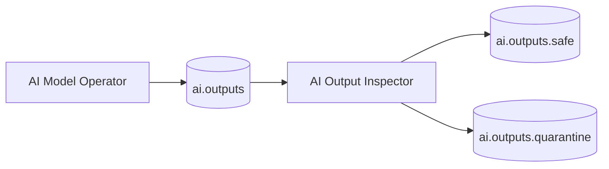

# ArqonBus Safety Inspection & Policy – A Practical Guide

This tutorial focuses on **spec 002 – content-aware safety inspection** and how it fits into the architecture:

- Where inspectors sit in the flow.
- How they interact with policy and observability.
- How to design inspection flows without breaking multi-tenancy or performance.

It complements the formal spec in `docs/arqonbus/specs/002-content-aware-safety-inspection/spec.md`.

---

## 1. Where Inspectors Live in the System

### 1.1 Conceptual placement

Inspectors are operators that:

- See a copy of certain messages.
- Analyze content and context.
- Attach labels, veto or modify messages, and emit safety telemetry.

```mermaid
flowchart LR
  C[Client / Producer]
  S[Shield\n(WebSocket / Gateway)]

  subgraph Bus["Spine (Bus)"]
    R[Router]
    SafeTopic[(safe.\noutput)]
    Quarantine[(quarantine.\noutput)]
  end

  subgraph Inspect["Safety Inspectors (002)"]
    I1[Inspector A\n(e.g. toxicity)]
    I2[Inspector B\n(e.g. policy)]
  end

  D[Downstream Consumers]

  C --> S --> R
  R --> I1
  R --> I2

  I1 -->|allow| SafeTopic
  I2 -->|allow| SafeTopic
  I1 -->|block/label| Quarantine
  I2 -->|block/label| Quarantine

  SafeTopic --> D
```

Actual routing can be configured via:

- Control-plane config (which topics are inspectable).
- Policy-as-code (`docs/arqonbus/plan/policy_as_code.md`).

### 1.2 Fail-closed behavior

The constitution/doctrine require safety paths to:

- Prefer **fail-closed** over fail-open when:
  - Inspectors are required for a given flow.
  - Inspectors themselves fail or time out.

This usually means:

- Messages either:
  - Do not leave the trusted scope, or
  - Are downgraded or quarantined, rather than blindly forwarded.

---

## 2. Inspectable vs Non-Inspectable Flows

### 2.1 Inspectable flows

Typical inspectable flows include:

- User-generated content (chat, posts, comments).
- AI model outputs that may be user-visible.
- Program capsules that carry executable code or side-effectful logic.

For these flows, configs might specify:

- `inspection_required: true`
- `inspectors: ["toxicity", "policy", "pii"]`

### 2.2 Non-inspectable or opaque flows

Some flows cannot or should not be inspected:

- End-to-end encrypted payloads.
- Sensitive data where legal constraints forbid inspection.

For these, configs might specify:

- `inspection_required: false`
- Additional obligations at the endpoint (e.g. local scanning, key management).

The spec emphasizes **explicitness**:

- Whether a flow is inspectable or not must be a conscious, documented choice.

---

## 3. Designing an Inspector Operator

### 3.1 Inputs and outputs

An inspector typically:

- Subscribes to:
  - One or more topics (e.g. `chat.*`, `ai.outputs.*`).
- Emits:
  - Safety labels and decisions on:
    - A control topic (e.g. `safety.decisions`).
    - An internal bus or state (for inline enforcement).
  - Telemetry on:
    - `security.anomalies`, `safety.metrics`.

### 3.2 Example: AI output inspector



Pseudo-logic:

```text
for each message in ai.outputs:
  score = toxicity_model(message.payload.text)
  if score > threshold:
    route to ai.outputs.quarantine
    emit anomaly event
  else:
    route to ai.outputs.safe
```

### 3.3 Observability hooks

Inspectors should emit:

- Counters for:
  - Total inspected messages.
  - Allowed vs blocked.
  - Per-tenant and per-topic breakdowns.
- Structured logs:
  - Minimal, non-PII context.
  - Reasons for blocks (policy rule IDs, not raw content).

This supports:

- Auditing.
- Policy tuning.
- Capacity planning.

---

## 4. Multi-Tenancy and Policy-As-Code

### 4.1 Tenant-scoped policies

Policies can differ by tenant:

- Tenant A:
  - Strict content rules, mandatory inspection on many topics.
- Tenant B:
  - Narrower inspection scope (e.g., only public-facing channels).

Policy-as-code patterns (`plan/policy_as_code.md`) encourage:

- Storing policies in versioned configs.
- Applying them in CI (linting, validation).
- Rolling out changes safely and visibly.

### 4.2 Example policy snippet (conceptual)

```yaml
tenants:
  tenantA:
    inspect:
      - topic: "chat.public.*"
        inspectors: ["toxicity", "policy"]
        required: true
      - topic: "ai.outputs.*"
        inspectors: ["toxicity"]
        required: true
  tenantB:
    inspect:
      - topic: "chat.global.*"
        inspectors: ["policy"]
        required: false
```

---

## 5. Integrating Inspectors into CI and Governance

Inspection logic should:

- Have **specs** under `docs/arqonbus/specs/`.
- Be enforced by CI:
  - Spec presence.
  - Tests.
  - Coverage thresholds for critical rules.

The engineering doctrine and checklists ask each PR to answer:

- Does this change touch safety or inspection logic?
- How are invariants enforced?
- How will we observe behavior in staging/production?

---

## 6. Next Steps

From here:

- See `docs/arqonbus/specs/002-content-aware-safety-inspection/spec.md` for formal definitions.
- Move on to:
  - `tutorial/arqonbus_qhe_integration.md` for attaching QHE engines behind the bus.
  - `tutorial/arqonbus_emergent_operators.md` for emergent and structural-intelligence operators.

