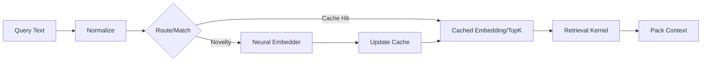

# ArqonReflex: Beyond RAG

**Strategic Vision Document**  
**Version**: 0.1.0  
**Date**: December 30, 2025  
**Status**: Vision / Pre-Specification

---

## Executive Summary

**ArqonReflex** is a semantic intelligence layer that **eliminates neural embedding from the hot path** by treating semantic computation as a **change event**, not a per-request cost.

Traditional RAG assumes every query is novel:
```
text → neural embedding → ANN search → fetch → pack
```

ArqonReflex inverts this assumption:
```
text → normalize → route/cache → pack   (hot path, <100μs)
           ↓
    [on novelty only]
           ↓
     neural embedding → cache update   (slow path, rare)
```

The result: **99% of semantic lookups never touch a neural network**.

---

## The Core Insight

> **In a constitutional MAS, most "queries" aren't truly novel.**

Agent queries are overwhelmingly one of:

| Query Type | Frequency | Example |
|------------|-----------|---------|
| **Command-ish** | 60-80% | "load spec", "show constitution", "what governs X" |
| **Template variants** | 15-25% | Same intent, different surface text |
| **Scope-bound** | 5-10% | Same tag/module/realm, narrow retrieval |
| **Truly novel** | <5% | Genuine new phrasing requiring embedding |

ArqonReflex exploits this distribution to move embedding to the **update path** instead of the **query path**.

---

## The Pattern: Semantic Address Space

ArqonReflex is **DNS for meaning**:

1. Raw text becomes a *hint*
2. The system maps it to a **canonical query ID** (or small candidate set)
3. The canonical ID has precomputed embedding + precomputed top-k docs
4. Hot path retrieval is pure **integer + cache**



---

## Three-Tier Architecture

### Tier 0: Command Router (No Embedding)
**Latency**: Nanoseconds

```python
# Pattern match → direct fetch
if query.matches_command("load spec"):
    return CANON["spec"]
if query.matches_command("show constitution"):
    return CANON["constitution"]
```

Commands don't need semantic similarity—they need **deterministic routing**.

---

### Tier 1: Semantic Cache (Pre-computed)
**Latency**: Microseconds

Two cache levels:

| Level | Key | Value | Speed |
|-------|-----|-------|-------|
| L1 | `hash(normalized_text)` | Embedding vector | Skip neural, still do ANN |
| L2 | `hash(normalized_text)` | Top-k doc IDs + scores | Skip neural AND ANN |

L2 hits turn the entire system into **KV lookup + RAM fetch**.

---

### Tier 2: Neural Embedding (On Novelty)
**Latency**: Single-digit milliseconds

Only triggered when:
- No cache hit
- Routing confidence below threshold
- Explicit "force fresh" flag

The embedder is now a **learning mechanism**, not a runtime tax.

---

## Integration with ArqonBus

ArqonReflex plugs into the ArqonBus Tier architecture:

| ArqonBus Tier | ArqonReflex Role |
|---------------|------------------|
| **Tier 1** (Deterministic) | Command router, cache lookup |
| **Tier 2** (Adaptive) | Cache invalidation, confidence routing |
| **Tier Ω** (Emergent) | Novel embedding, cache learning |

### Message Flow

```
┌──────────────────────────────────────────────────────────────┐
│  Agent Query                                                  │
└───────────────────────────┬──────────────────────────────────┘
                            ▼
┌──────────────────────────────────────────────────────────────┐
│  ArqonReflex Router (Tier 1)                                  │
│  ├── Command pattern match → CANON docs                       │
│  ├── Semantic cache lookup (L1/L2)                           │
│  └── Routing confidence check                                │
└───────────────────────────┬──────────────────────────────────┘
                            │ [cache miss / low confidence]
                            ▼
┌──────────────────────────────────────────────────────────────┐
│  ArqonReflex Embedder (Tier Ω, rare)                         │
│  ├── Tokenize + Embed (FP16/INT8 ONNX)                       │
│  ├── Update L1/L2 cache                                       │
│  └── Store canonical query record                            │
└───────────────────────────┬──────────────────────────────────┘
                            ▼
┌──────────────────────────────────────────────────────────────┐
│  Retrieval Kernel (Rust, <100μs)                             │
│  ├── ANN search (cylinder-quantized vectors)                  │
│  ├── Payload fetch from Valkey/RAM                           │
│  └── Context packing                                         │
└──────────────────────────────────────────────────────────────┘
```

---

## CANON: The Constitutional Shortcut

For constitutional MAS, governing documents must **never be missed**.

ArqonReflex treats CANON as a **RAM-resident always-included set**:

```python
CANON = {
    "constitution": always_loaded,
    "spec": always_loaded,
    "dossier": always_loaded,
}

def build_context(query, retrieved_docs):
    # CANON is always first, no embedding required
    context = list(CANON.values())
    # Retrieved docs are supporting evidence
    context.extend(retrieved_docs)
    return context
```

This does two things:
1. **Prevents "missed constitution" disasters**
2. **Reduces pressure on embedding quality** for critical alignment

---

## Cache Invalidation: Compute on Change

Caches invalidate on **change events**, not time:

| Event | Invalidation Scope |
|-------|-------------------|
| Epoch advance | Namespace/tag-scoped entries |
| CANON update | All L2 entries (governance docs changed) |
| Index rebuild | Full cache flush |
| Parameter change | Affected query patterns |

### Valkey Epoch Protocol

```python
# On document change
async def on_document_update(doc_id, namespace, epoch):
    # Publish epoch advance
    await valkey.publish(f"epoch:{namespace}", epoch)
    # Invalidate affected L2 entries
    await valkey.hdel(f"l2_cache:{namespace}", ...)

# Agents subscribe to epoch changes
async def on_epoch_advance(namespace, epoch):
    # Pull delta since last known epoch
    updates = await get_updates_since(namespace, last_epoch)
    # Refresh local cache
    refresh_cache(updates)
```

---

## The Key Metric: Neural Avoidance Rate (NAR)

The success of ArqonReflex is measured by:

```
NAR = 1 - (#neural_embeds / #queries)
```

| NAR | Effect |
|-----|--------|
| 80% | p50 collapses to microseconds |
| 95% | p95 collapses to microseconds |
| 99% | System feels **instant** |

Target: **NAR ≥ 95%** for production MAS deployments.

---

## Hardware Path

| Component | Target Hardware | Role |
|-----------|-----------------|------|
| Command Router | CPU (any) | Pattern matching, ns-scale |
| Semantic Cache | CPU + RAM | Hash lookup, μs-scale |
| Retrieval Kernel | Rust/SIMD | Integer similarity, <100μs |
| Neural Embedder | RTX 2060 / ONNX | Cache-miss path, ms-scale |

The Xeon E5-2680 v3 (AVX2) handles routing and retrieval.
The GPU is reserved for **rare** embedding events.

---

## Relationship to Existing Arqon Stack

| Component | Integration |
|-----------|-------------|
| **ArqonBus** | Control plane for cache updates, epoch pub/sub |
| **ArqonHPO** | Tune cache/routing thresholds, embedding confidence |
| **ArqonNAS** | Discover optimal routing patterns, cache structures |
| **ArqonController** | Enforce NAR SLOs, rollback on degradation |
| **voltron-core** | Rust data plane for retrieval kernel |

---

## System Fabric Connection

ArqonReflex embodies the **compute-on-change** doctrine from the System Fabric research:

> "Memory as a fabric property with critical feedback."

The semantic cache is a **fabric-level memory** with:
- **Critical thresholds** (NAR, confidence bounds)
- **Epoch-based invalidation** (change-driven, not time-driven)
- **Competitive write dynamics** (which queries update cache, with what priority)

---

## Next Steps

### Phase 0: Define Evaluation Harness
- 100-300 query truth set
- Must-include governing docs
- Measure critical miss rate and NAR

### Phase 1: Command Router + L1 Cache
- Implement pattern-based command routing
- Hash-keyed embedding cache
- FP16 ONNX embedder for cache misses

### Phase 2: L2 Cache + Epoch Invalidation
- Precomputed top-k cache
- Valkey epoch pub/sub integration
- CANON always-loaded guarantee

### Phase 3: Full ArqonBus Integration
- ArqonReflex as Tier-1/2 operator
- NAR telemetry on ArqonBus channels
- ArqonHPO tuning of confidence thresholds

---

## Vision Statement

> **ArqonReflex transforms semantic retrieval from a per-request neural cost into a fabric-level pre-computation.**
>
> By treating embedding as a **change event** and routing as **cache lookup**, ArqonReflex enables constitutional agents to think at **machine speed** while maintaining **perfect governance alignment**.
>
> This is not "faster RAG." This is **beyond RAG**.

---

*Document maintained by the ArqonTech Architecture Team*
